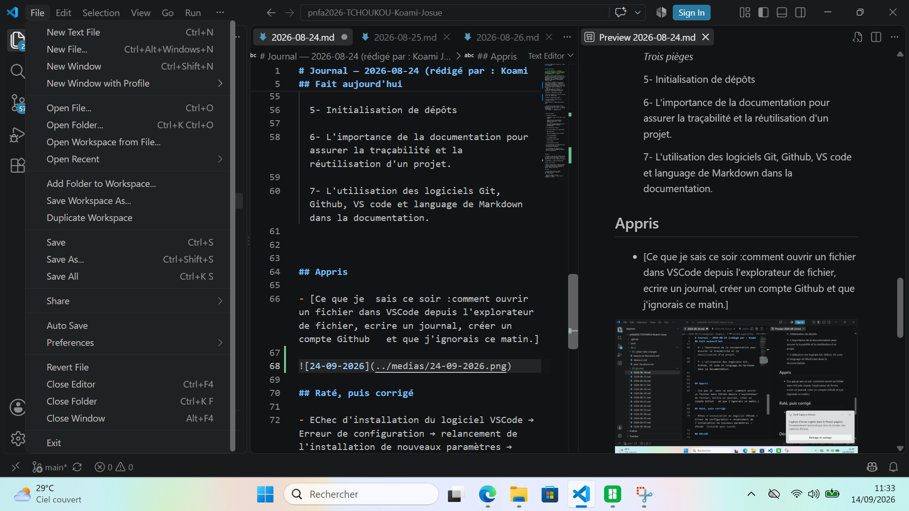

# Journal — 2026-08-24 (rédigé par : Koami Josué TCHOUKOU)

## Fait aujourd'hui

-  >Il sonne 6h 50 min à l'Institut National De Formation et de Perfectionnent Professionnels(INFPP) et la casi-totalité des FabManagers est là presente.

- A 7h15, on nous a fait diriger vers la grande salle de formation d'en haut pour la ceromonie d'ouverture de la formation des fabmanagers pour les FabLabs et centres Regionaux d'Innovqtions Technologiques(CRIT) au Togo.

- A 8h 40, la céromonie a été lancée et dans l'ordre croissante, M. Emile Kossi N'GUISSANLe Responsable de l'INFPP, Mr le responsable de la FNAFPP et Mr Le Ministre de l'Education Nationale(MEN)ont fait leurs discours pour situer le contexte de l'assise.
-  Nous avons aussi la chance de la présence des directeurs  centraux , des inspecteurs et des esperts formateurs.

- Après la ceremonie les officiels ont fait le tour des installations

- et sont descendus prendre une vue d'ensemble avec nous.

- Les activités furent lancées avec les formateurs et nous avons appris à faire la documentation avec les outils : Git,VSCode,Github,Pages.
- Le formateur est KAMEKPO Giovani.

+ Nous avons appris :

  1- Pourquoi documenter

    *Documenter ce que ce n'est pas, ce que c'est.*
    
    *4Fonctions de la documentation(Mémoire, transmission, preuve,contribution)*
    
    *Les cinq principes(Quotidienne,Datée et signée, honnête, Complète, Réutilisable)*
    
  2- Le cadre de le formation

  3- Les outils VSCode, Git, Github,Pages

    *Qui fait quoi*
    
    *Les trois espaces de votre travail*
    
    *Trois conséquences*

  4- Le langage Markdown

    *Aide-mémoire syntaxique*
    
    *Trois pièges*

  5- Initialisation de dépôts

  6- L'importance de la documentation pour assurer la traçabilité et la réutilisation d'un projet.

  7- L'utilisation des logiciels Git, Github, VS code et language de Markdown dans la documentation.

 
 
## Appris

- [Ce que je  sais ce soir :comment ouvrir un fichier dans VSCode depuis l'explorateur de fichier, ecrire un journal, créer un compte Github   et que j'ignorais ce matin.]

## Raté, puis corrigé

- EChec d'installation du logiciel VSCode → Erreur de configuration → relancement de l'installation de nouveaux paramètres → VSCode  installé qvec succès

## Décidé

- Toujours bien relire les étapes d'installation avant d'avancer  
## À faire demain

- [Faire un Commit ] — Josué
- [Publier le Commit sur Github dans la communauté ] — Josué
