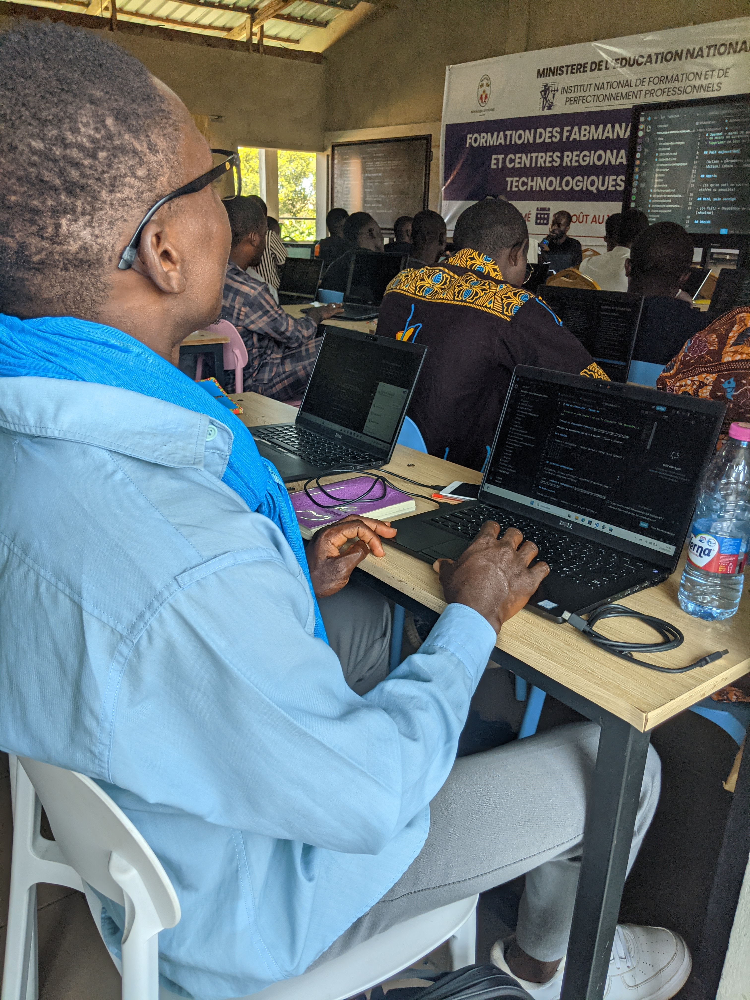
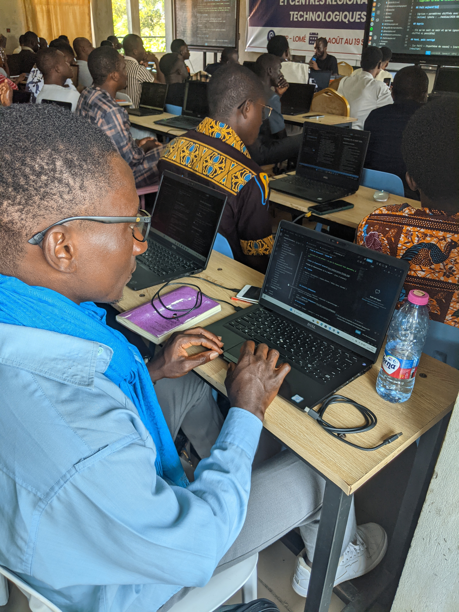

# Journal — 2026-08-25 (rédigé par : Koami Josué TCHOUKOU)

## Fait aujourd'hui

- [Rejoindre la communauté de PNFA-FAB-MANAGER-MEN , créer un commit, pulier le commit dans son depôt sur Github, A la découverte du réseau FabLabs + paramètres : 1 une invitaion reçue et acceptée]
- Module sur la découverte des fablabs : présentation de la charte internationnale des fablabs; des inventaires de référence et des réseaux de fablabs présentés par l'expert formateur M. Sylvestre OLANLO. [Paramètre : 1 charte étudié, 6 principes retenus, 2 réseaux étudiés]

- 

 

## Appris

- Ce que sais ce soir : 

 - Le premier FabLab du Togo est WOELAB, fondé en 2012 par l'architecte Sénamé Koffé Agbodjinou.Il se repose sur deux principes (La Lowhightech & l'Open Source).

 - FabLab ,Makerspace et Atelier sont différents l'un de l'autre.

 - L'inventaire de référence
 1- Découpe laser 2- Fraiseuse CNC 3- Fraiseuse de precision 4- Découpe Vinyle 5- Impression 3D 6-Poste électronique

 - Ou vous vous situez dans le réseau 

 - les Six rubriques de la Fab Charter

 1- Mission 2- Accès 3- Education 4-Responsabilité 5- Confidentialité 6- Activités Commerciales

 et que j'ignorais ce matin

## Raté, puis corrigé

- Le premier Fablab du Togo → Le manque de recherche → J'ai appris de la reponse donnée
## Décidé

- Toujours me documenter sur le domaine des fablabs

## À faire demain

- [La fabrication additive] — Josué
- [Elaboration de projets] — Josué
