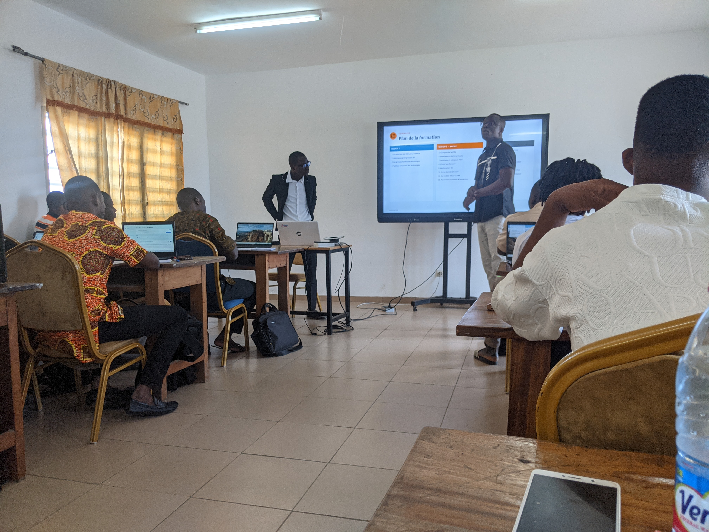
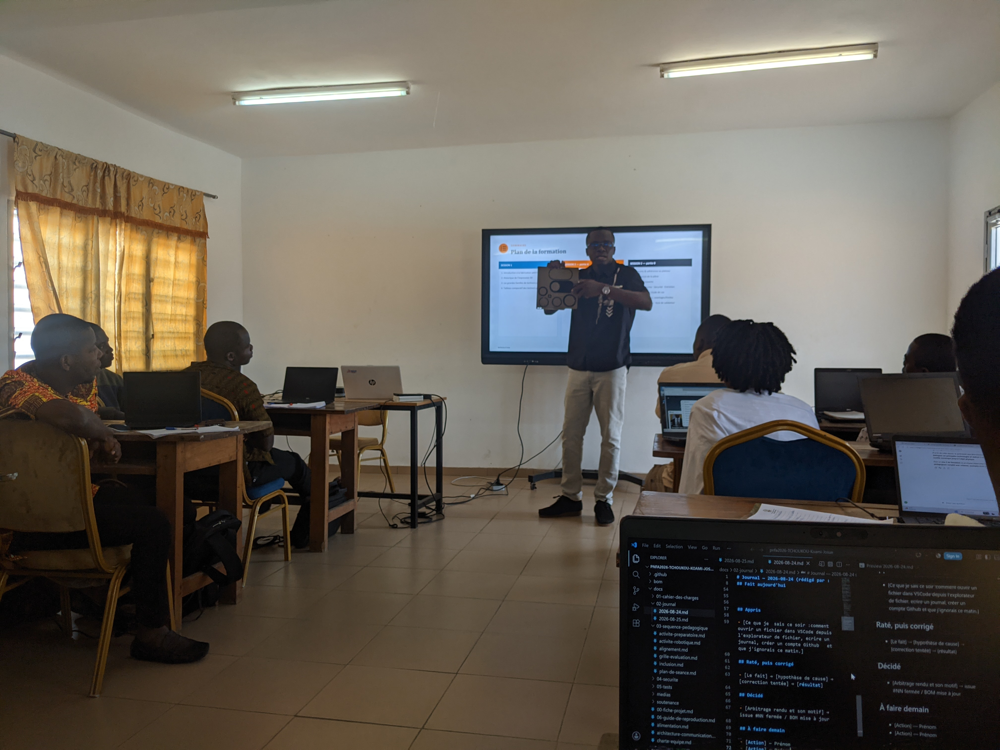

# Journal — 2026-08-26 (rédigé par : Koami Josué TCHOUKOU)

## Fait aujourd'hui

- [ Session 1 : Comprendre la fabrication Additive 
    
    Toucher du doigt la modelisation 3D et l'impression 3D, vu les erreurs faites par un apprenant dans le positionnement de l'impression et la manière dont celà a été corrigée.

    
    Les trois logiques de fabrication 

    Du fichier numérique à l'objet physique 

    Les grandes familles de technologies

      + paramètres chiffrés avec unités]
- 

    

Session 2 

Elaboration des projets 

Le protjet doit être contextuel.Il doit être realiste.A la fin on veut un projet qui comporte un périphérique de sortie, un dispositif, un périphérique de sortie et un micro-controleur

Session 3 
La Découpe Laser

1- Anatomie d'une découpe laser
2- Les grandes Familles de lasers 
3- Sécurité Laser: les classes IEC 60825-1
4- Comment choisir sa machine Laser

Session 4

Les Bases de l'éléctronique dans les FabLabs

Les grandeurs éléctriques de base 

les symboles de base 

le condensateur 

le multimetre : l'outil de base du Fablab

La mesure avec un multimètre.

## Appris

- [Ce que je sais ce soir  **1- Les imprimantes 3D sont différentes des fabrications traditionnelles. 2-Pour imprimer il faut prendre en compte : La température, La Vitesse d'impression et Le Filament. 3- Le PLA est fait à base d'amidon et Le PETG à base du plastique. 4- Il est important de tester le filament pendant 10 min environ si on ne le connaît pas. 5- 1Rouleau de filament varie entre 300 et 350 m.Son prix commerciale commence à partir de 15000 FCFA.  6- Avec le fibre de carbone il faut plus de température. 7- L'ABS est fait à base d'Hydrocarbure 8- SP32S3 est supérieur à Arduino** et que  j'ignorais ce matin , chiffré si possible]

## Raté, puis corrigé

- Mésurer la tension de la prise d'éléctricité dans le mur → Le bout du muk → [correction tentée] → [résultat]

## Décidé

- [Arbitrage rendu et son motif] → issue #NN fermée / BOM mise à jour

## À faire demain

- [Comception de carte de visite avec Xtool] — Josué
- [Cyberpi & l'écosystème mBuild] — Josué
