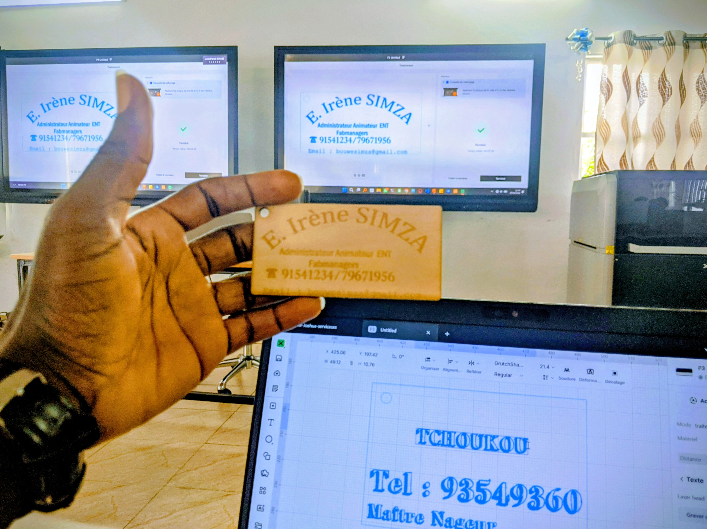

# Journal — 2026-08-27 (rédigé par : Koami Josué TCHOUKOU)

## Fait aujourd'hui

- Conception de la carte de visite avec Xtool+ paramètres chiffrés avec unités
- Découverte de l'interface Xtool
- CyberPi & l'écosytème mBuild
- Du modèle 3D au G-Code : Le rôle du slicer

- 
-  .jpg)

 

## Appris

- [Ce qu'on sait ce soir 
 - Pour lancer la coupure avec Xtool, il faut regler la puissance sur 90 et la vitesse sur 50. 
 - Pour graver avec Xtool il faut regler lapuissance sur 20 et la vitesse sur 600
 - Tous les sens physiques de l'humain ont leurs équivalents dans la programmation
 - La cyberPi en un clein d'oeil
 - Capteur ou actionneur 
 - Les capteurs mBuild
 - Les actionneurs mBuild 
 - Pratique avec le MBlock 
 - La découverte de l'interface MBlock
 - Allumer les leds du cyberPi
 - Changer les couleurs
 - Programmer les feux tricolores
 - Eternaliser une action avec la commande "Pour Toujours" 
 - Capteur de lumière avec l'extension Liht Sensor
 - Paramètres clés : couche et températures 
 - Paramètres clés : Vitesse, débit, rétraction
 - Le remplissage (Infill)
 - Parois et couches supérieures / inférieures 
 - Les supports
 - La découverte de l'interface Bambou Lab 
 et qu'on ignorait ce matin]

## Raté, puis corrigé

- Allumer les leds du CyberPi de la droite vers la gauche l'un après l'autre selon un ordre de couleurs prédefinies puis de la gauche vers la droite → manque de réglages de la position du led à allumer dans la commande  → Régler les positions des leds à allumer → j'ai reussi la programmation

## Décidé

- Accepter de reprendre pour parfaire

## À faire demain

- [Préparation et impression d'un fichier 3D] — Josué
- [Découpage laser] — Josué
